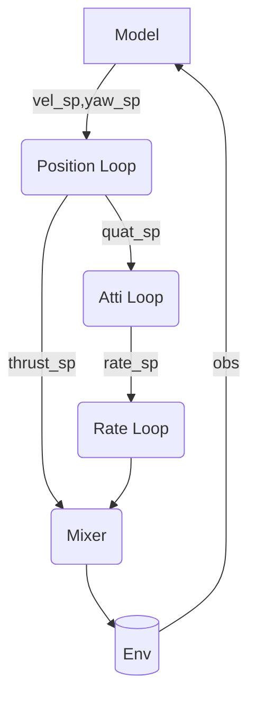

# rlPx4Controller

rlPx4Controller is a quadcopter control library implemented in C++ and provides a python interface through pybind11. The implementation of the controller is consistent with the Px4 flight control to ensure the consistency of sim2real.

4 modules have been implemented so far

- PolyTrajGen: Fifth degree polynomial trajectory generation
- Lemniscate:  Figure-eight curve generation
- pyControl: Single aircraft controller
- pyParallelControl：Multi-aircraft controller for reinforcement learning


## install

```bash
# Install Eigen. The recommended version is 3.3.7
sudo apt install libeigen3-dev
pip install pybind11
# 安装rlPx4Controller
pip install -e .
```


### 准备

1. 下载模型，[内网下载](http://qyswarm.top/data/share/x-152bV2.1.zip)
1. 解压，并修改`test/robot/drone.py `中的`local_assets_path` 为模型存放位置

test将仿真与控制分开为了两个程序，通过UDP通讯实现交互，你可以通过以下命令测试多项式轨迹飞行。

> 存在的bug, 因为yaw计算方式的原因，最后飞机会跳一下

```python
cd test
PYTHON_PATH_22 sim.py 
```

```python
cd test
PYTHON_PATH_22 ploy_pos_ctl.py 
```


## Try it quickly

对于单机 可以使用 `pyControl `

```python
from pyControl import PosControl,AttiControl,RateControl,Mixer

controller.pos_ctl.set_status(pos_world,velocity_world,angular_velocity_world,rot_quat,current_time-last_rate_control_time)
atti_thrust_sp = controller.pos_ctl.update(exp_pos,np.array([0,0,0]),np.array([0,0,0]),float(yaw))

print("hover_thrust {} ".format(controller.pos_ctl.get_hover_thrust()))

rate_sp = controller.atti_ctl.update(atti_thrust_sp[:4],rot_quat)

controller.rate_ctl.set_q_world(rot_quat)
thrust_3 = controller.rate_ctl.update(rate_sp,angular_velocity_world,np.array([0,0,0]),current_time-last_rate_control_time)

thrust = controller.mix_ctl.update(np.array([thrust_3[0],thrust_3[1],thrust_3[2],atti_thrust_sp[4]]))

```

## 对于并行训练

由于python for循环太慢了，因此选择在`pyParallelControl` 这个包中实现，目前仅实现了`ParallelRateControl`

```python
from pyParallelControl import ParallelRateControl

rateControl = ParallelRateControl(envs_num)
cmd = rc.update(rate_sp,rate,dt)
```


## pyi生成

pybind11，生成的python库，无法直接跳转，但是 `pybind11_stubgen` 可以在当前工作空间生成可跳转的pyi文件。
vscode 中的 python插件 默认从${WORKSPACE_DIR}/typings中寻找pyi文件因此有如下命令

```bash
rm -rf typings
PYTHON_PATH_22 -m pybind11_stubgen  PolyGen -o typings
PYTHON_PATH_22 -m pybind11_stubgen  pyControl -o typings
PYTHON_PATH_22 -m pybind11_stubgen  pyParallelControl -o typings

```


## 原理

### pwm到力和转矩的映射
在isaacsim中，没有空气动力学，因此直接使用 力和转矩 控制无人机。
在现实中，我们通过控制pwm的脉宽(一般是 1~2ms)控制电机的转速，进而控制无人机，因此需要一层由pwm到力和转矩的映射。
首先我们将pwm指令映射到$u\in[0,1]$，u 到 力(f)和力矩$(\tau)$ 的关系可建模为

$$
\begin{aligned}
    f(u) &= k_2^f u^2+k_1^f u+k_0^f \\
    \tau(u) &= k_2^{\tau} u^2+k_1^{\tau} u+k_0^{\tau}
\end{aligned}
$$

在仿真中一般只用2次项，即

$$
\begin{aligned}
    f(u) &= k_2^f u^2 \\
    \tau(u) &= k_2^{\tau} u^2
\end{aligned}
$$


### 动力学解算

获得力和力矩后，可以使用仿真器内置的刚体动力学引擎进行解算。
以下实现都是仿真器内部实现。
<!-- 参数主要为，质量，和惯性矩阵。 -->

最原始的形式为 牛顿和欧拉方程为
- $\mathbf{J}$ 为惯性矩阵

$$
\begin{aligned}
    f &= m \dot{v} \\
    \tau &= \mathbf{J}\dot{\mathbf{\omega}}+\omega \times (\mathbf{J}\mathbf{\omega})
\end{aligned}
$$


那么对于飞行器机体，合力为

$$
\begin{aligned}
\boldsymbol{\eta} & =\left[\begin{array}{c}\frac{\sqrt{2}}{2} l\left(-f_{1}+f_{2}+f_{3}-f_{4}\right)\\
\frac{\sqrt{2}}{2} l\left(-f_{1}+f_{2}-f_{3}+f_{4}\right) \\
-\tau_{1}-\tau_{2}+\tau_{3}+\tau_{4}\end{array}\right],\\
m c & =f_{1}+f_{2}+f_{3}+f_{4},
\end{aligned}
$$

电机顺序为


电机的执行一般有延迟，可用如下模型描述

> $\alpha_{\mathrm{mot}}$ 需要实际测试得到

$$
\begin{aligned}
\dot{\mathbf{f}} &= \frac{1}{\alpha_{mot}}(\mathbf{f} _ {des}-\mathbf{f})\\
\dot{\mathbf{\eta}} &=\frac{1}{\alpha_{mot}}(\mathbf{\eta}_{des}-\mathbf{\eta})
\end{aligned}
$$

以下为uzh-rpg 团队文档中给出的飞行器动力学模型，添加了各种阻力？(R,),

- $\tau_g$ 是 gyroscopic torques from the propellers
- $\mathbf{D}=diag(d_x,d_y,d_z)$ 是 a constant diagonal matrix
formed by the rotor-drag coefficients
- $\mathbf{A}$ 和 $\mathbf{B}$ are constant matrices

但是大部分仿真器给这些值都是0，阻力的添加可以参考Gazebo中风的添加

$$
\begin{aligned}
\dot{\mathbf{p}}&=\mathbf{v} \\
\dot{\mathbf{v}}&=-g \mathbf{z} _ {\mathrm{w}}+c \mathbf{z} _ {\mathrm{B}}-\mathbf{R D} \mathbf{R}^{\top} \mathbf{v} \\
\dot{\mathbf{R}}&=\mathbf{R} \hat{\mathbf{\omega}} \\
\dot{\mathbf{\omega}}&=\mathbf{J}^{-1}\left(\mathbf{\eta}-\mathbf{\omega} \times \mathbf{J} \mathbf{\omega}-\mathbf{\tau}_{\mathrm{g}}-\mathbf{A} \mathbf{R}^{\top} \mathbf{v}-\mathbf{B} \mathbf{\omega}\right) \\
\end{aligned}
$$


# 速度控制结构

