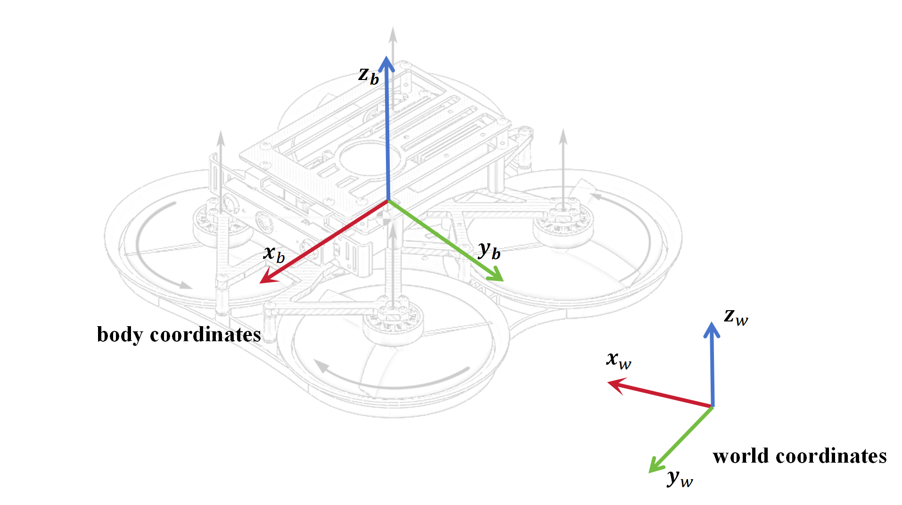

Dynamic Model
==================

Coordinates System
------------------

In this project, we make use of a world frame :math:`{W}` with orthonormal basis :math:`{\mathbf{x}_W, \mathbf{y}_W, \mathbf{z}_W}` represented
in world coordinates and a body frame :math:`{B}` with orthonormal basis :math:`{\mathbf{x}_B, \mathbf{y}_B, \mathbf{z}_B}` also represented in
world coordinates. 

    
    Fig.1 coordinates
.. :caption: coordinates

.. .. image:: ./assets/coordinates.png
..     :name:

.. :alt: coordinates
.. :align: center
.. :caption: coordinates

Single Rotor Model
------------------

We model  the single rotor thrust :math:`f` and drag torque :math:`\tau` as ploynomials 
of the motor input :math:`u` as

.. math:: 
    f(u) = k_2^f u^2+k_1^f u+k_0^f 

    \tau(u) = k_2^{\tau} u^2+k_1^{\tau} u+k_0^{\tau}

where the coefficients :math:`k_j^f` and  :math:`k_j^\tau` are identified by running a single motor with a propller
on a load cell and measuring the resulting forces and moments.The motor input :math:`u \in (0,1)`.

Additionally, we model the dynamic of the single rotor thrusts as first order systems

.. math::
    \dot{\mathbf{f}} = \frac{1}{\alpha_{mot}}(\mathbf{f} _ {des}-\mathbf{f})

    \dot{\mathbf{\eta}} =\frac{1}{\alpha_{mot}}(\mathbf{\eta}_{des}-\mathbf{\eta})

where the coefficient :math:`\alpha_{\mathrm{mot}}` is also obtained through identification.

Quadcopter Model
----------------

[] provides a more accurate dynamic description.

.. math:: 
   \dot{\mathbf{p}} &= \mathbf{v} 
   
   \dot{\mathbf{v}}&=-g \mathbf{z} _ {\mathrm{w}}+c \mathbf{z} _ {\mathrm{B}}-\mathbf{R D} \mathbf{R}^{\top} \mathbf{v}
   
   \dot{\mathbf{R}}&=\mathbf{R} \hat{\mathbf{\omega}}
   
   \dot{\mathbf{\omega}}&=\mathbf{J}^{-1}\left(\mathbf{\eta}-\mathbf{\omega} \times \mathbf{J} \mathbf{\omega}-\mathbf{\tau}_{\mathrm{g}}-\mathbf{A} \mathbf{R}^{\top} \mathbf{v}-\mathbf{B} \mathbf{\omega}\right)

where, :math:`\tau_g` is torques from the propellers , :math:`\mathbf{D}=diag(d_x,d_y,d_z)`
is a constant diagonal matrix formed by the rotor-drag coefficients, :math:`\mathbf{A}` and :math:`\mathbf{B}` are constant matrices.

However, in most quadcopter simulations, the model is simplified to

.. math:: 
   \dot{\mathbf{p}} &= \mathbf{v} 
   
   \dot{\mathbf{v}}&=-g \mathbf{z} _ {\mathrm{w}}+c \mathbf{z} _ {\mathrm{B}}
   
   \dot{\mathbf{R}}&=\mathbf{R} \hat{\mathbf{\omega}}
   
   \dot{\mathbf{\omega}}&=\mathbf{J}^{-1}\left(\mathbf{\eta}-\mathbf{\omega} \times \mathbf{J} \mathbf{\omega}\right)

If you need to add resistance, you can refer to Gazebo's Adding Stroke Resistance

However, these items are omitted in most simulators.To add resistance, please refer to the addition of wind resistance in Gazebo.

.. math::     
    f(u) = k_2^f u^2 

    \tau(u) = k_2^{\tau} u^2

.. math:: 
    \boldsymbol{\eta} = \left[\begin{array}{c}\frac{\sqrt{2}}{2} l\left(-f_{1}+f_{2}+f_{3}-f_{4}\right) \\
    \frac{\sqrt{2}}{2} l\left(-f_{1}+f_{2}-f_{3}+f_{4}\right) \\
    -\tau_{1}-\tau_{2}+\tau_{3}+\tau_{4}\end{array}\right]

    m c =f_{1}+f_{2}+f_{3}+f_{4}

.. math:: 
    f &= m \dot{v} 

    \tau &= \mathbf{J}\dot{\mathbf{\omega}}+\omega \times (\mathbf{J}\mathbf{\omega})

where :math:`\mathbf{J}` is the inertia matrix